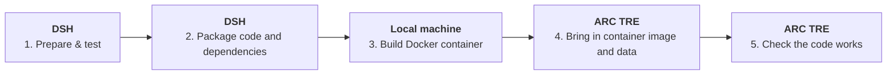

# End-to-End Migration Pipeline for a Python Project

This guide walks through moving a Python project from the DSH (Data Safe Haven) into the ARC TRE (Trusted Research Environment), packaging it as a Docker container along the way.

## Overview



Five steps, three environments:

1. **DSH** – prepare and test your code.
2. **DSH** – package the code and its dependencies.
3. **Local machine** – build the code into a Docker container.
4. **ARC TRE** – bring the container image and data in through the Airlock.
5. **ARC TRE** – confirm the code runs correctly.

---

## Step 1 – DSH: Prepare and test your code

Clone the project and note down its version and a timestamp, so the packaged copy is traceable back to an exact commit.

```bash
git clone https://github.com/mxochicale/PLAYGROUND-dsh-tre-migrating-projects.git
cd PLAYGROUND-dsh-tre-migrating-projects

VERSION=$(git rev-parse --short HEAD)
TIMESTAMP=$(date +%Y%m%d-%H%M%S)
```

At this point, develop and test your code as normal in the DSH.

### Working with a virtual environment (uv)

Install `uv` (macOS and Linux):

```bash
curl -LsSf https://astral.sh/uv/install.sh | sh
```

Create a virtual environment and install the project's dependencies:

```bash
uv venv
uv pip install -e .
```

Activate the environment and launch Jupyter Lab:

```bash
source .venv/bin/activate
jupyter lab
```

When you're done:

- Log out from the Jupyter menu, or press `Ctrl-C` in the terminal to stop it.
- If a Jupyter process is left running, kill it with:
  ```bash
  pkill -f jupyter
  ```

Remove the virtual environment once you no longer need it:

```bash
rm -rf .venv
```

### Converting notebooks to scripts

If your work is in a notebook, convert it to a plain Python script before packaging:

```bash
jupyter nbconvert --to script <notebook-filename.ipynb>
```

---

## Step 2 – DSH: Package the code and dependencies

Compress the project folder into a versioned, timestamped zip file:

```bash
cd ..
zip -r "githubproject-${VERSION}-${TIMESTAMP}.zip" PLAYGROUND-dsh-tre-migrating-projects
```

> **Note:** zip the same folder you cloned into (here, `PLAYGROUND-dsh-tre-migrating-projects`). Double-check the folder name matches your project before running this.

To unzip it again elsewhere:

```bash
unzip githubproject-*.zip
```

---

## Step 3 – Local machine: build the Docker container

### Build the image with metadata baked in

Tagging the image with the version, git commit, and build date makes it easy to trace later.

```bash
VERSION=0.0.1
GIT_SHA=$(git rev-parse --short HEAD)
BUILD_DATE=$(date -u +"%Y-%m-%dT%H:%M:%SZ")

docker build \
  --label "org.opencontainers.image.version=${VERSION}" \
  --label "org.opencontainers.image.revision=${GIT_SHA}" \
  --label "org.opencontainers.image.created=${BUILD_DATE}" \
  --no-cache \
  -t my_container:${VERSION} .
```

### Test the image locally

```bash
docker run -it --rm my_container:0.0.1 bash
# then, inside the container:
# python dsh-tre-code/00-dsh-jupyter-lab-session.py
```

### Save and checksum the image

Save the image to a tarball and generate a checksum, so you (and the TRE reviewers) can confirm it hasn't been altered in transit.

```bash
OUTDIR=~/Downloads
NAME=my_container_0.0.1.tar.gz

docker save my_container:0.0.1 | gzip > "${OUTDIR}/${NAME}"
cd "${OUTDIR}" && sha256sum "${NAME}" > "${NAME}.sha256"
```

---

## Step 4 – ARC TRE: Bring in the container image and data

Upload `my_container_0.0.1.tar.gz` and its checksum file to the TRE through the [Airlock](https://tre.arc.ucl.ac.uk/). Then, from the TRE desktop:

```bash
INDIR=~/shared/inbound/$(whoami)
cd "${INDIR}"

sha256sum -c my_container_0.0.1.tar.gz.sha256
docker load -i my_container_0.0.1.tar.gz
```

`sha256sum -c` confirms the file matches the checksum generated in Step 3, before you load it.

---

## Step 5 – ARC TRE: Check the code works

Run the container inside the TRE exactly as you did locally, to confirm it behaves the same way:

```bash
docker run -it --rm my_container:0.0.1 bash
# then, inside the container:
# python dsh-tre-code/00-dsh-jupyter-lab-session.py
```

If this runs without errors and produces the expected output, the migration is complete.
