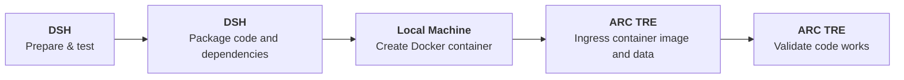

# python project 

## Migration user pipeline


## Local development

### Install uv (macOS and Linux)
```bash
curl -LsSf https://astral.sh/uv/install.sh | sh
```

### Create a virtual environment and install dependencies
```bash
uv venv
uv pip install -e .
```

### Launch env and jupyter notebooks

```bash
source .venv/bin/activate #activate VE
jupyter lab
# logout from the menu
# ctrl-c to exit
# kill them
# pkill -f -1 jupyter*
```

### Remove envorinment
```bash
rm -rf .venv
```

### Convert jupyter notebooks to python scripts
```bash
jupyter nbconvert --to script <notebook-filename.ipynb> 
```


## Docker

* Build with metadata baked in

```bash
VERSION=0.0.1
GIT_SHA=$(git rev-parse --short HEAD)
BUILD_DATE=$(date -u +"%Y-%m-%dT%H:%M:%SZ")

docker build \
  --label "org.opencontainers.image.version=${VERSION}" \
  --label "org.opencontainers.image.revision=${GIT_SHA}" \
  --label "org.opencontainers.image.created=${BUILD_DATE}" \
  --no-cache \
  -t my_container:${VERSION} .
```

* Launch bash container
```bash
docker run -it --rm my_container:0.0.1 bash
#RUN: python dsh-tre-code/00-dsh-jupyter-lab-session.py
```

* Save container to tar, and checksum it so you (and TRE reviewers) can verify integrity after transfer:

```bash
OUTDIR=~/Downloads
NAME=my_container_0.0.1.tar.gz
docker save my_container:0.0.1 | gzip > "${OUTDIR}/${NAME}"
cd "${OUTDIR}" && sha256sum "${NAME}" > "${NAME}.sha256"
```


* Upload my-container.tar to the TRE through the [Airlock](https://tre.arc.ucl.ac.uk/), open desktop run the TRE desktop:
```bash
INDIR=~/shared/inbound/$(whoami)
cd "${INDIR}" && sha256sum -c my_container_0.0.1.tar.gz.sha256
docker load -i my_container_0.0.1.tar.gz
```


